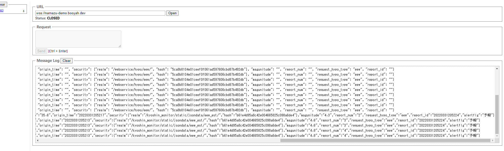
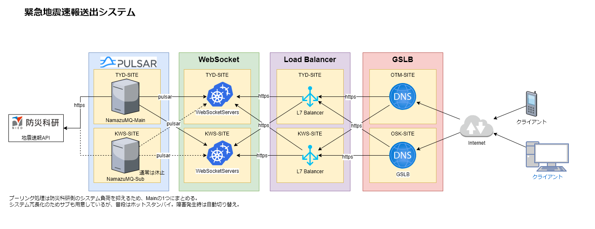

<p align="center">
  
</p>

# Namazu
防災科研の新強震モニタの緊急地震速報データをWebSocketを通して配信するシステムです。  
なるべく防災科研のサーバに負荷を掛けないように配慮しつつ、高速かつ安定的に送出する事を目的としています。

# 注意点
あくまで学術研究のためであり、サーバを一時的に止めたりする可能性があります。また商用利用などはお控え下さい。  
また予告なく提供を終了する場合もありますのでご承知おきください。

# API
```
　本番URI: wss://namazu.booyah.dev

テストURI: wss://namazu-demo.booyah.dev
```
※非SSLでの提供はありません。


# レスポンスデータ
通常時
```
{"result": {"status": "success", "message": "データがありません", "is_auth": true}, "report_time": "", "region_code": "", "request_time": "20220403233914", "region_name": "", "longitude": "", "is_cancel": "", "depth": "", "calcintensity": "", "is_final": "", "is_training": "", "latitude": "", "origin_time": "", "security": {"realm": "/webservice/hypo/eew/", "hash": "5ca8b8104e01ceef0f061ad597606cbd87b492db"}, "magunitude": "", "report_num": "", "request_hypo_type": "eew", "report_id": ""}
```
発信時
```
{"result":{"status":"success","message": "","is_auth":true},"report_time":"2022/03/31 20:52:29","region_code":"","request_time":"20220331205229","region_name":"東京湾","longitude":"140","is_cancel":false,"depth":"70km","calcintensity":"3","is_final":false,"is_training":false,"latitude":"35.6","origin_time":"20220331205213","security":{"realm":"/kyoshin_monitor/static/jsondata/eew_est/","hash":"b61e4d95a8c42e004665825c098a6de4"},"magunitude":"4.6","report_num":"3","request_hypo_type":"eew","report_id":"20220331205224","alertflg":"予報"}
```

# Chrome拡張での確認方法
GoogleChromeの拡張機能「[WebSocket Test Client](https://chrome.google.com/webstore/detail/websocket-test-client/fgponpodhbmadfljofbimhhlengambbn?hl=ja)」で確認が出来ます。  

上記の拡張機能をインストールし開くと、「URL」の欄がありますので上記のAPIのアドレスを入れて「Open」をクリックすると電文が出力されます。



# システム構成
